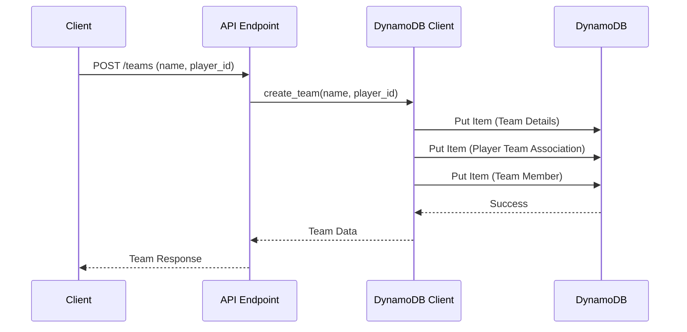
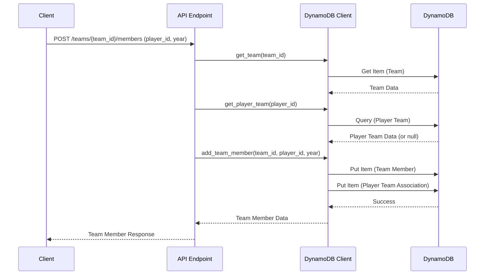

# Multi-Tenancy with Teams Implementation Plan

## Overview

We'll augment the current DynamoDB schema to support Teams as a new entity type. Teams will be collections of Players, with a Team Coordinator role (a Player with admin rights) who can manage team membership. Players will belong to only one Team at a time, and Teams will persist across years with the ability to add or remove Players at the start of a new year.

## Current System Architecture

The current system uses a single-table DynamoDB design with composite primary keys (PK and SK) to model different entity types:

1. **Players**: Participants in the game
   - PK: `PLAYER#{player_id}`
   - SK: `DETAILS`

2. **People**: Potential picks that players can choose
   - PK: `PERSON#{person_id}`
   - SK: `DETAILS`

3. **Draft Orders**: The order in which players make their picks for each year
   - PK: `YEAR#{year}`
   - SK: `ORDER#{draft_order}#PLAYER#{player_id}`

4. **Player Picks**: The actual picks made by players
   - PK: `PLAYER#{player_id}`
   - SK: `PICK#{year}#{person_id}`

## Proposed Changes

### 1. DynamoDB Schema Additions

#### New Entity: Teams

```
- PK: `TEAM#{team_id}`
- SK: `DETAILS`
- Attributes:
  - Type: "Team"
  - Name: string
  - CreatedAt: string (ISO format)
  - CoordinatorId: string (player_id of the team coordinator)
```

#### Team Membership

To track which players belong to which teams, we'll add:

```
- PK: `TEAM#{team_id}`
- SK: `MEMBER#{player_id}#YEAR#{year}`
- Attributes:
  - Type: "TeamMember"
  - JoinedAt: string (ISO format)
  - Active: boolean (indicates if the player is active for that year)
```

#### Player Team Association

To easily look up which team a player belongs to:

```
- PK: `PLAYER#{player_id}`
- SK: `TEAM#{team_id}`
- Attributes:
  - Type: "PlayerTeam"
  - JoinedAt: string (ISO format)
  - IsCoordinator: boolean
```

### 2. Model Updates

We'll need to add new Pydantic models to represent Teams and related operations:

```python
# Team Models
class Team(BaseModel):
    """
    Pydantic model for Team data.
    """
    id: str
    name: str
    created_at: datetime
    coordinator_id: str
    member_count: Optional[int] = None

class TeamMember(BaseModel):
    """
    Pydantic model for Team Member data.
    """
    player_id: str
    player_name: str
    joined_at: datetime
    is_coordinator: bool
    active: bool
    year: int

class TeamCreate(BaseModel):
    """
    Pydantic model for creating a new Team.
    """
    name: str

class TeamUpdate(BaseModel):
    """
    Pydantic model for updating Team data.
    """
    name: Optional[str] = None
    coordinator_id: Optional[str] = None

class TeamMemberAdd(BaseModel):
    """
    Pydantic model for adding a member to a Team.
    """
    player_id: str
    year: int

class TeamMemberUpdate(BaseModel):
    """
    Pydantic model for updating a Team Member.
    """
    active: Optional[bool] = None
    year: Optional[int] = None

class TeamResponse(BaseModel):
    """
    Pydantic model for API responses containing Team data.
    """
    message: str
    data: Team

class TeamListResponse(BaseModel):
    """
    Pydantic model for API responses containing multiple Teams.
    """
    message: str
    data: List[Team]

class TeamMemberResponse(BaseModel):
    """
    Pydantic model for API responses containing Team Member data.
    """
    message: str
    data: List[TeamMember]
```

### 3. DynamoDB Client Updates

We'll extend the `DynamoDBClient` class with methods to handle Teams:

```python
# New methods for DynamoDBClient

async def create_team(self, name: str, coordinator_id: str) -> Dict[str, Any]:
    """
    Create a new team with the given coordinator.
    """
    # Implementation details

async def get_team(self, team_id: str) -> Optional[Dict[str, Any]]:
    """
    Get a specific team by ID.
    """
    # Implementation details

async def get_teams(self) -> List[Dict[str, Any]]:
    """
    Get all teams.
    """
    # Implementation details

async def update_team(self, team_id: str, updates: Dict[str, Any]) -> Dict[str, Any]:
    """
    Update a team's details.
    """
    # Implementation details

async def add_team_member(self, team_id: str, player_id: str, year: int) -> Dict[str, Any]:
    """
    Add a player to a team for a specific year.
    """
    # Implementation details

async def remove_team_member(self, team_id: str, player_id: str, year: int) -> bool:
    """
    Remove a player from a team for a specific year.
    """
    # Implementation details

async def get_team_members(self, team_id: str, year: Optional[int] = None) -> List[Dict[str, Any]]:
    """
    Get all members of a team, optionally filtered by year.
    """
    # Implementation details

async def get_player_team(self, player_id: str) -> Optional[Dict[str, Any]]:
    """
    Get the team a player belongs to.
    """
    # Implementation details
```

### 4. API Endpoints

We'll add new endpoints to the `deadpool.py` router:

```python
# Team endpoints

@router.post("/teams", response_model=TeamResponse)
async def create_team(team_create: TeamCreate, player_id: str = Query(..., description="The ID of the player creating the team")):
    """
    Create a new team with the specified player as coordinator.
    """
    # Implementation details

@router.get("/teams", response_model=TeamListResponse)
async def get_teams():
    """
    Get all teams.
    """
    # Implementation details

@router.get("/teams/{team_id}", response_model=TeamResponse)
async def get_team(team_id: str = Path(..., description="The ID of the team to get")):
    """
    Get a specific team's information.
    """
    # Implementation details

@router.put("/teams/{team_id}", response_model=TeamResponse)
async def update_team(
    team_id: str = Path(..., description="The ID of the team to update"),
    updates: TeamUpdate = None,
    player_id: str = Query(..., description="The ID of the player making the update")
):
    """
    Update a team's information. Only the team coordinator can update the team.
    """
    # Implementation details

@router.get("/teams/{team_id}/members", response_model=TeamMemberResponse)
async def get_team_members(
    team_id: str = Path(..., description="The ID of the team to get members for"),
    year: Optional[int] = Query(None, description="Filter members by year")
):
    """
    Get all members of a team, optionally filtered by year.
    """
    # Implementation details

@router.post("/teams/{team_id}/members", response_model=TeamMemberResponse)
async def add_team_member(
    team_id: str = Path(..., description="The ID of the team to add a member to"),
    member: TeamMemberAdd = None,
    player_id: str = Query(..., description="The ID of the player making the request")
):
    """
    Add a player to a team. Only the team coordinator can add members.
    """
    # Implementation details

@router.delete("/teams/{team_id}/members/{member_id}", response_model=TeamResponse)
async def remove_team_member(
    team_id: str = Path(..., description="The ID of the team to remove a member from"),
    member_id: str = Path(..., description="The ID of the player to remove"),
    year: int = Query(..., description="The year to remove the player from"),
    player_id: str = Query(..., description="The ID of the player making the request")
):
    """
    Remove a player from a team for a specific year. Only the team coordinator can remove members.
    """
    # Implementation details

@router.get("/players/{player_id}/team", response_model=TeamResponse)
async def get_player_team(
    player_id: str = Path(..., description="The ID of the player to get the team for")
):
    """
    Get the team a player belongs to.
    """
    # Implementation details
```

## Implementation Approach

### Phase 1: Schema and Model Updates

1. Update the DynamoDB schema documentation to include the new Team entities
2. Add the new Pydantic models to `models/deadpool.py`

### Phase 2: DynamoDB Client Extensions

1. Implement the new Team-related methods in `utils/dynamodb.py`
2. Add unit tests for the new methods

### Phase 3: API Endpoints

1. Implement the new Team-related endpoints in `routers/deadpool.py`
2. Add appropriate logging and error handling
3. Add unit tests for the new endpoints

### Phase 4: Integration and Testing

1. Test the new endpoints with real data
2. Verify that existing functionality continues to work correctly
3. Document the new API endpoints

## Data Flow Diagrams

### Team Creation Flow



### Adding a Team Member Flow



## Database Access Patterns

### New Access Patterns

1. Get Team Details
   ```
   PK = TEAM#{team_id}
   SK = DETAILS
   ```

2. Get Team Members
   ```
   PK = TEAM#{team_id}
   SK begins_with MEMBER#
   Optional filter by year: SK begins_with MEMBER#YEAR#{year}#
   ```

3. Get Player's Team
   ```
   PK = PLAYER#{player_id}
   SK begins_with TEAM#
   ```

4. Get All Teams
   ```
   Scan with filter:
   SK = DETAILS AND begins_with(PK, TEAM#)
   ```

## Considerations and Tradeoffs

### Advantages

1. **Minimal Schema Changes**: The proposed design leverages the existing single-table approach, making it easier to implement and maintain.
2. **Efficient Queries**: The access patterns are optimized for common operations like getting team details, team members, and a player's team.
3. **Year-Based Membership**: The design supports tracking team membership by year, allowing for changes in team composition over time.
4. **Coordinator Role**: The team coordinator role is clearly defined and can be used for access control.

### Challenges

1. **Data Consistency**: We need to ensure that a player can only belong to one team at a time, which requires careful transaction handling.
2. **Migration**: Existing players will need to be associated with teams, which may require a data migration strategy.
3. **Performance**: Some operations, like getting all teams, will require table scans which could impact performance with large datasets.